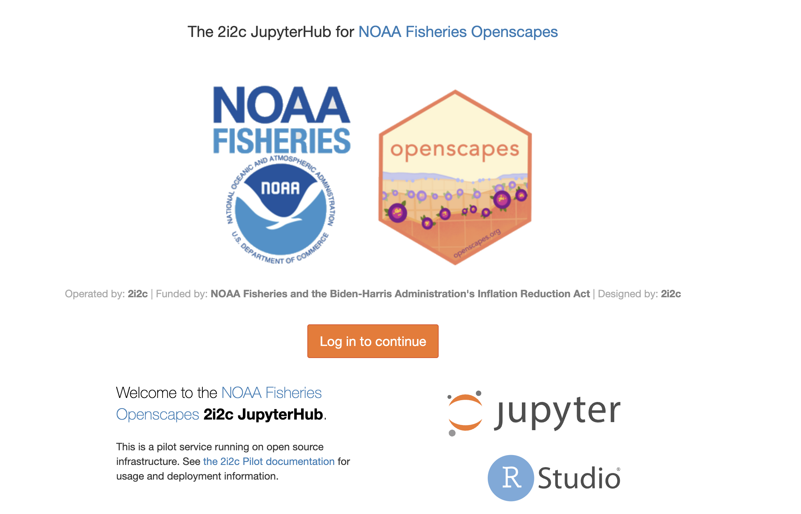

The NMFS Openscapes JupyterHub is managed by [Openscapes](https://openscapes.cloud/) and  developed in partnership with the International Interactive Computing Collaboration [2i2c](https://2i2c.org/). Launched in September 2024, the NMFS Openscapes JupyterHub joins the NASA Openscapes JupyterHub in providing a curated interactive computing platform to support training in earth and life science visualization, computing and analysis. The NMFS Openscapes JupyterHub supports [workshops](content/workshops.html) and [trainings](content/hackhours.html) run by NOAA Fisheries. 

