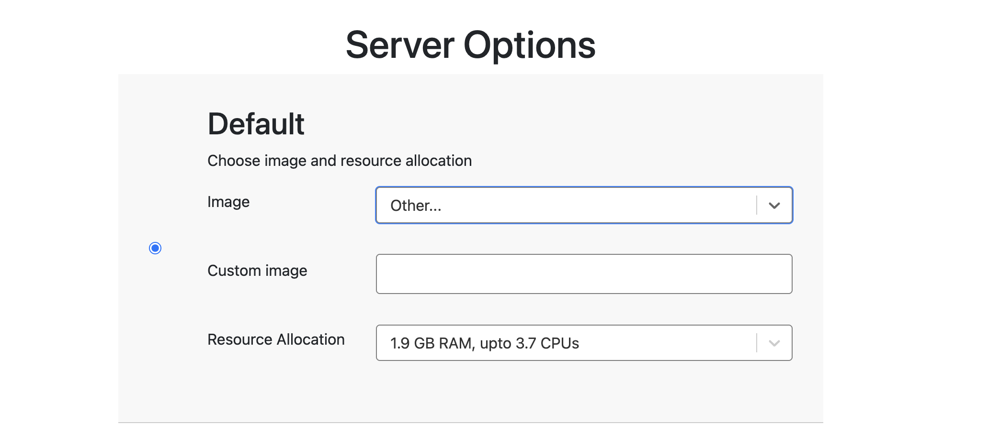

## Other images on the hub

Use the dropdown to select a non-default image on the hub. There are a variety. You can learn about
them on the [NMFS Open Science container images](https://nmfs-opensci.github.io/container-images/) repo.


## Using other images not on the hub

The JupyterHub can run other images that are compatible with a JupyterHub, e.g. Binder images. 
When you start the hub, use the image dropdown to select "Other":



You can add a url to a Docker image to this. For example, if you wanted to use the
[Pangeo notebook docker images](https://github.com/pangeo-data/pangeo-docker-images)
image, you would paste one of these into the "Custom image" box.

From DockerHub: `pangeo/pangeo-notebook`
From Quay.io `quay.io/pangeo/pangeo-notebook`

Other common data science images:

* [Jupyter Docker Stacks](https://jupyter-docker-stacks.readthedocs.io/en/latest/)
* [NASA Openscapes python](https://hub.docker.com/r/openscapes/python)
* [Rocker Binder image](https://hub.docker.com/r/rocker/binder)
* [Pangeo](https://github.com/pangeo-data/pangeo-docker-images)
* [geocompx](https://github.com/geocompx/docker)
* [GPU accelerated data science docker images](https://github.com/b-data)

## Using a GitHub repo

You can also create an environment with a MyBinder.org compatible GitHub repo. By selecting the "Build your own image"
option.


### Simple example for Python

There are two ways to do this. Either via a conda environment or a pip install.

[conda example](https://github.com/binder-examples/conda)

1. Put an `environment.yml` file in your GitHub repo at the base level with your Python packages that you need.
2. Copy the url to your repo and paste that into the "Repository" box (above).

environment.yml
```
name: example-environment
channels:
  - conda-forge
dependencies:
  - python=3.11
  - numpy
  - psutil
  - toolz
  - matplotlib
  - dill
  - pandas
  - partd
  - bokeh
  - dask
```

[pip install example](https://github.com/binder-examples/requirements)

You will need `requirements.txt` for packages and `runtime.txt` for the Python version.

requirements.txt
```
numpy
matplotlib==3.*
seaborn==0.13.*
pandas
```

runtime.txt
```
python-3.10
```

### Simple example for R

[r example](https://github.com/binder-examples/r)

You will need `install.R` for packages and `runtime.txt` for the R version.

install.R
```
install.packages("tidyverse")
install.packages("rmarkdown")
install.packages("httr")
install.packages("shinydashboard")
install.packages("leaflet")
```

runtime.txt
```
r-4.3.2-2024-01-10
```


